Chapter 2 Predicting Algae Blooms
=================================

This case study will introduce you to some of the basic tasks of any data mining
problem:

- data pre-processing
- exploratory data analysis
- predictive model construction

### 2.1 Problem description and objectives

#### Background:

High concentrations of certain harmful algae in rivers is a serious ecological
problem with a strong impact not only on river lifeforms, but also on water
quality. Being able to monitor and perform an early forecast of algae blooms is
essential to improve the quality of rivers.

#### Sample:

7 water samples were collected in different European rivers at different times during a period of approximately one year. For each water sample, different chemical properties were measured as well as the frequency of occurence of 7 harmful algae. Some other characteristics of the water collection process were also stored, such as the season of the year, the river size, and the river speed.

#### Motivation:

*One of the main* motivations behind this application lies in the fact that chemical monitoring is cheap and easily automated, while the biological analysis of the sample to identify the algae that are present in the water involves microscopic examination, requires trained manpower and is therefore both expensive and slow.

Obtaining models that are able to accurately predict the algae frequencies based on chemical properties would facilitate the creation of cheap and automated systems for monitoring harmful algae blooms.

*Another* objective of this study is to provide a better understanding of the factors influencing the algae frequencies. namely, we want to understand how these freuqencies are related to certain chemical attributes of water samples as well as other characteristics of the sample (like season of the year, type of river, etc.).

### 2.2 Data Description

The data consists of two separate text files:

- training set: `"Analysis.txt"` with 200 water samples
- test set: `"Eval.txt"` with 140 water samples
  - the information concerning the values of the concentrations of the 7 algae was ommitted
  - the *goal* is to predict the frequencies of the 7 algae for these 140 samples

Each water sample is described in 11 variables:

- 3 are nominal
  - season of the year when the sample was collected as `season`
  - the size of the river as `size`
  - the water speed of the river as `speed`
- 8 are values of different chemical parameters measured in the water sample
  - maximum pH value squared as `mxPH`
  - minimum value of O2 (Oxygen) as `mnO2`
  - mean value of Cl (Chloride) as `Cl`
  - mean value of NO3- (Nitrates) as `NO3`
  - mean value of NH4+ (Ammonium) as `NH4`
  - mean of PO43- (Orthophosphate) as `oPO4`
  - mean of total PO4 (Phosphate) as `PO4`
  - mean of Chlorophyll as `Chla`

Associated with each of these water samples are 7 frequency numbers of different harmful algae found in the water samples. No information is given regarding which algae were identified.

### 2.3 Loading the data into `R`

#### Load data from file

Firtsly check the current working directory of running `R` session by `getwd()`, or we can change the directory by `setwd()`.

After downloading the data files into the directory, start by loading into `R the data from the `"Analysis.txt"` file (the training data).

```
algae <- read.table('Analysis.txt',
                    header=F,
                    dec='.'
                    col.name=c('season','size','speed','mxPH','mnO2','Cl',
                               'NO3','NH4','oPO4','PO4','Chla',
                               'a1','a2','a3','a4','a5','a6','a7'),
                    na.strings=C('XXXXXXX'))
```

- `read.table`: function that can be used to read data contained in file. The result of this function is a data frame.
- `header=F`: the file to be read does not include a first line the variables names (default)
- `dec='.'`: the numbers used the `'.'` character to separate decimal places (default)
- `col.names`: provide a vector with the names to give to the variables whose values are being read
- na.strings`: indicate a vector of strings that are to be interpreted as unknown values. These values are represented internally in `R` by the value `NA`

#### Load data rom package

Simply load the book package `DMwR` to have a data frame named `algae` available for use. This data frame contains the first set of 200 observations mentioned above.


```r
library(DMwR)
```

```
## Loading required package: lattice
## Loading required package: grid
## KernSmooth 2.23 loaded
## Copyright M. P. Wand 1997-2009
```

```r
head(algae)
```

```
##   season  size  speed mxPH mnO2    Cl    NO3    NH4   oPO4    PO4 Chla
## 1 winter small medium 8.00  9.8 60.80  6.238 578.00 105.00 170.00 50.0
## 2 spring small medium 8.35  8.0 57.75  1.288 370.00 428.75 558.75  1.3
## 3 autumn small medium 8.10 11.4 40.02  5.330 346.67 125.67 187.06 15.6
## 4 spring small medium 8.07  4.8 77.36  2.302  98.18  61.18 138.70  1.4
## 5 autumn small medium 8.06  9.0 55.35 10.416 233.70  58.22  97.58 10.5
## 6 winter small   high 8.25 13.1 65.75  9.248 430.00  18.25  56.67 28.4
##     a1   a2   a3  a4   a5   a6  a7
## 1  0.0  0.0  0.0 0.0 34.2  8.3 0.0
## 2  1.4  7.6  4.8 1.9  6.7  0.0 2.1
## 3  3.3 53.6  1.9 0.0  0.0  0.0 9.7
## 4  3.1 41.0 18.9 0.0  1.4  0.0 1.4
## 5  9.2  2.9  7.5 0.0  7.5  4.1 1.0
## 6 15.1 14.6  1.4 0.0 22.5 12.6 2.9
```


### 2.4 Data Visualization and Summarization

It is always a good idea to start our analysis with some kind of exploratory data analysis. A first idea of the statistical propeties of the data can be obtained through a summary of its descriptive statistics:


```r
summary(algae)
```

```
##     season       size       speed         mxPH           mnO2      
##  autumn:40   large :45   high  :84   Min.   :5.60   Min.   : 1.50  
##  spring:53   medium:84   low   :33   1st Qu.:7.70   1st Qu.: 7.72  
##  summer:45   small :71   medium:83   Median :8.06   Median : 9.80  
##  winter:62                           Mean   :8.01   Mean   : 9.12  
##                                      3rd Qu.:8.40   3rd Qu.:10.80  
##                                      Max.   :9.70   Max.   :13.40  
##                                      NA's   :1      NA's   :2      
##        Cl             NO3             NH4             oPO4      
##  Min.   :  0.2   Min.   : 0.05   Min.   :    5   Min.   :  1.0  
##  1st Qu.: 11.0   1st Qu.: 1.30   1st Qu.:   38   1st Qu.: 15.7  
##  Median : 32.7   Median : 2.67   Median :  103   Median : 40.1  
##  Mean   : 43.6   Mean   : 3.28   Mean   :  501   Mean   : 73.6  
##  3rd Qu.: 57.8   3rd Qu.: 4.45   3rd Qu.:  227   3rd Qu.: 99.3  
##  Max.   :391.5   Max.   :45.65   Max.   :24064   Max.   :564.6  
##  NA's   :10      NA's   :2       NA's   :2       NA's   :2      
##       PO4             Chla              a1              a2       
##  Min.   :  1.0   Min.   :  0.20   Min.   : 0.00   Min.   : 0.00  
##  1st Qu.: 41.4   1st Qu.:  2.00   1st Qu.: 1.50   1st Qu.: 0.00  
##  Median :103.3   Median :  5.47   Median : 6.95   Median : 3.00  
##  Mean   :137.9   Mean   : 13.97   Mean   :16.92   Mean   : 7.46  
##  3rd Qu.:213.8   3rd Qu.: 18.31   3rd Qu.:24.80   3rd Qu.:11.38  
##  Max.   :771.6   Max.   :110.46   Max.   :89.80   Max.   :72.60  
##  NA's   :2       NA's   :12                                      
##        a3              a4              a5              a6       
##  Min.   : 0.00   Min.   : 0.00   Min.   : 0.00   Min.   : 0.00  
##  1st Qu.: 0.00   1st Qu.: 0.00   1st Qu.: 0.00   1st Qu.: 0.00  
##  Median : 1.55   Median : 0.00   Median : 1.90   Median : 0.00  
##  Mean   : 4.31   Mean   : 1.99   Mean   : 5.06   Mean   : 5.96  
##  3rd Qu.: 4.92   3rd Qu.: 2.40   3rd Qu.: 7.50   3rd Qu.: 6.92  
##  Max.   :42.80   Max.   :44.60   Max.   :44.40   Max.   :77.60  
##                                                                 
##        a7      
##  Min.   : 0.0  
##  1st Qu.: 0.0  
##  Median : 1.0  
##  Mean   : 2.5  
##  3rd Qu.: 2.4  
##  Max.   :31.6  
## 
```


- nominal variables: provides frequency counts for each possible value
- numeric variables: gives a series of statistics like mean, median, quartiles information and exteme values. these statistics provide a first idea of the distribution of the variable values.
- missing values: shows the frequency counts of `NA` if a variable haves some unknown values

*TIP* By observing the difference between medians and means, as well as the inter-quartile range (3rd quartile minus the 1st quartile), we can get an idea of the skewness of the distribution and also its spread.

#### observe the distribution graphically


```r
hist(algae$mxPH, prob = T)
```

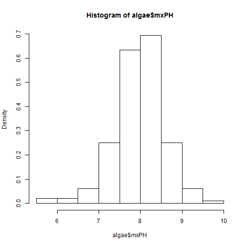 


- `hist()`: function for generating histogram
- `algae$mxPH`: values of variable `mxPH` from data frame `algae`
- `prob=T`: show probabilities for each interval, while omitting this parameter setting would give frequency counts

#### Q-Q plots

The function `qq.plot()` ,in the `car` (Fox, 2009) package, obtains normal Q-Q plots with a slightly more sophisticated version of the histogram


```r
library(car)
```

```
## Error: there is no package called 'car'
```

```r
par(mfrow = c(1, 2))
hist(algae$mxPH, prob = T, xlab = "", main = "Histogram of maximum pH value", 
    ylim = 0:1)
lines(density(algae$mxPH, na.rm = T))
rug(jitter(algae$mxPH))
qqPlot(algae$mxPH, main = "Normal QQ plot of maximum pH")
```

```
## Error: 没有"qqPlot"这个函数
```

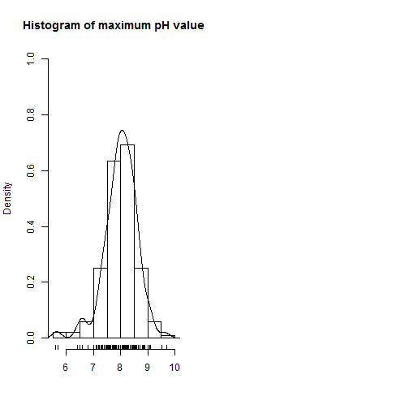 


- `par()`: set several parameters of the `R` graphics system
- `hist()`:
  - `xlab=''`: remove X-axis label
  - `main='XXX'`: change title
  - `ylim=0:1`: limits for the Y-axis
- `lines(density(mxPH,na.rm=T))`: plots a smooth version of the histogram (a kernel density estimate of the distribution of the variable).
  - `na.rm=T`: indicates that `NA` values should not be considered in the function calculation
- `rug(jitter(algae$mxPH))`: plots the real values of the variable near the X-axis, allowing easy spotting of outliers
- `qqPlot()`:
  - plots the variable values against the theoretical quantiles of a normal distribution(solid black line)
  - plots an envelope with the 95% confidence interval of the normal distribution (dashed lines)
  
#### Visualize oPO4


```r
boxplot(algae$oPO4, ylab = "Orthophosphate (oPO4)")
rug(jitter(algae$oPO4), side = 2)
abline(h = mean(algae$oPO4, na.rm = T), lty = 2)
```

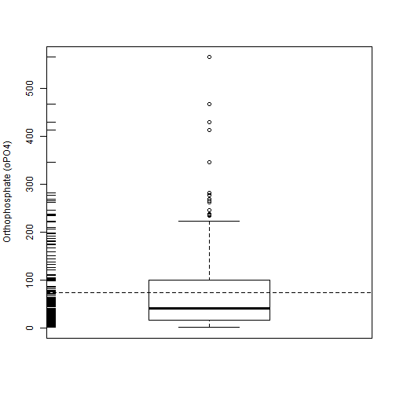 


- `boxplot`: draws a box plot
  - vertical limits being the 1st and 3rd qurtiles
  - the horizontal line represents the median value of the variable
  - the small horizontal dash above the box is the largest observation that is less than or equal to the 3rd quartile plus 1.5 x `r` where `r` is the inter-quartile range
  - the circles below or above these small dashes represent observations that are extremely low (high) compared to all others, and are usually considered outliers
- `rug()`: `side=2` means on Y-axis
- `abline`: draw a horizontal line at the mean value of the variable, which is obtained using the function `mean`. By comparing this line with the line inside the box indicating the median, we can conclude that the presence of several outliers has distorted the value of the mean as a statistic of centrality

#### identify the water sample with outliers


```r
plot(algae$NH4, xlab = "")
abline(h = mean(algae$NH4, na.rm = T), lty = 1)
abline(h = mean(algae$NH4, na.rm = T) + sd(algae$NH4, na.rm = T), lty = 2)
abline(h = median(algae$NH4, na.rm = T), lty = 3)
identify(algae$NH4)
```

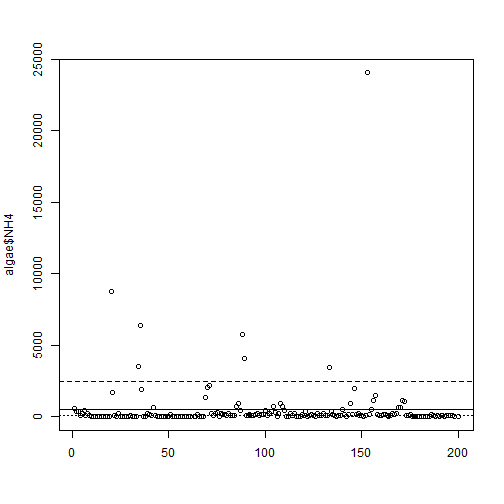 

```
## integer(0)
```


- `identify()`: allows user to interactively click on the plotted dots with the left mouse button (not working)

#### inspect the respective observations in the `algae` data frame


```r
plot(algae$NH4, xlab = "")
clicked.lines <- identify(algae$NH4)
```

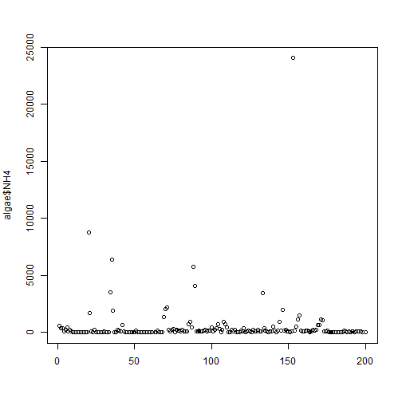 

```r
algae[clicked.lines, ]
```

```
##  [1] season size   speed  mxPH   mnO2   Cl     NO3    NH4    oPO4   PO4   
## [11] Chla   a1     a2     a3     a4     a5     a6     a7    
## <0 rows> (or 0-length row.names)
```


or without graphs


```r
algae[algae$NH4 > 19000, ]
```

```
##      season   size speed mxPH mnO2   Cl   NO3   NH4 oPO4 PO4 Chla  a1 a2
## NA     <NA>   <NA>  <NA>   NA   NA   NA    NA    NA   NA  NA   NA  NA NA
## 153  autumn medium  high  7.3 11.8 44.2 45.65 24064   44  34 53.1 2.2  0
## NA.1   <NA>   <NA>  <NA>   NA   NA   NA    NA    NA   NA  NA   NA  NA NA
##      a3  a4  a5   a6 a7
## NA   NA  NA  NA   NA NA
## 153   0 1.2 5.9 77.6  0
## NA.1 NA  NA  NA   NA NA
```


- uses a logical expression `>` to as a row seletor.

To avoid `NA` by

```r
algae[!is.na(algae$NH4) & algae$NH4 > 19000, ]
```

```
##     season   size speed mxPH mnO2   Cl   NO3   NH4 oPO4 PO4 Chla  a1 a2 a3
## 153 autumn medium  high  7.3 11.8 44.2 45.65 24064   44  34 53.1 2.2  0  0
##      a4  a5   a6 a7
## 153 1.2 5.9 77.6  0
```


- `is.na()` produces a vector of Boolean values (`TRUE` or `FALSE`). An element of this vector is `TRUE` when NH4 is `NA`. The construction `!is.na(algae$NH4)` thus returns a vector of Boolean values that are `TRUE` in positions corresponding to rows where NH4 is unknown.

#### explore by `lattice` package


```r
library(lattice)
bwplot(size ~ a1, data = algae, ylab = "River Size", xlab = "Algal A1")
```

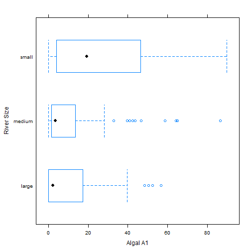 


- `bwplot()`:
  - `size ~ a1`: read as "plot `a1` for each value of `size`"

### explor by `Hmisc` package version of `bwplot`


```r
library(Hmisc)
```

```
## Error: there is no package called 'Hmisc'
```

```r
bwplot(size ~ a1, data = algae, panel = panel.bpplot, probs = seq(0.01, 0.49, 
    by = 0.01), datadensity = TRUE, ylab = "River Size", xlab = "Algal A1")
```

```
## Error: 找不到对象'panel.bpplot'
```


- The dots are the mean value of the frequency of the algal for the different river sizes
- Vertical lines represent the 1st quartile, median, and 3rd quartile, in that order
- Small dashes shows the actual values of the data
- Quantile plots show the information of the distribution of these values

#### observing the behavior of the frequency of algal `a3` conditioned by season and mnO2, this latter being a continuous variable


```r
minO2 <- equal.count(na.omit(algae$mnO2), number = 4, overlap = 1/5)
stripplot(season ~ a3 | minO2, data = algae[!is.na(algae$mnO2), ])
```

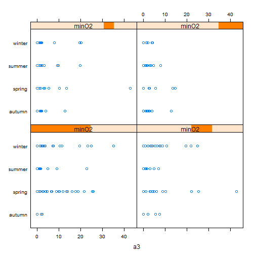 


- `equal.count()`: creates a factorized version of the continuous variable mnO2
  - `na.omit()`: removes any `NA` value from a vector
  - `number=4`: set the number of desired bins
  - `overlap=1/5`: sets the overlap between the bins near their repective boundaries
- `stripplot()` of `lattice` package: creates a graph containing the actual values of a variable, in different strips depending on another variable (in this case season)

### 2.5 Unkown Values

### 2.6 Obtaining Prediction Models

#### Multiple Linear Regression


```r
data(algae)
algae <- algae[-manyNAs(algae), ]
clean.algae <- knnImputation(algae, k = 10)
```


- `clean.algae`: data frame with no missing variable values


```r
lm.a1 <- lm(a1 ~ ., data = clean.algae[, 1:12])
```


- `lm()`: obtains a linear regression model
  - `a1 ~ .`: indicates the functional form of the model. It states that we want a model that predicts the variable a1 using all other variables present in the data, which is the meaning of the `.` dot character.
    - for example, if we want a model to predict a1 as a function of the variable mxPH and NH4, we should have indicated the model as `"a1 ~ mxPH + NH4"`
  - `data`: sets the data sample to be used to obtain the model


```r
summary(lm.a1)
```

```
## 
## Call:
## lm(formula = a1 ~ ., data = clean.algae[, 1:12])
## 
## Residuals:
##    Min     1Q Median     3Q    Max 
## -37.68 -11.89  -2.57   7.41  62.19 
## 
## Coefficients:
##              Estimate Std. Error t value Pr(>|t|)   
## (Intercept)  42.94206   24.01088    1.79   0.0754 . 
## seasonspring  3.72698    4.13774    0.90   0.3689   
## seasonsummer  0.74760    4.02071    0.19   0.8527   
## seasonwinter  3.69295    3.86539    0.96   0.3406   
## sizemedium    3.26373    3.80205    0.86   0.3918   
## sizesmall     9.68214    4.17997    2.32   0.0217 * 
## speedlow      3.92208    4.70631    0.83   0.4057   
## speedmedium   0.24676    3.24187    0.08   0.9394   
## mxPH         -3.58912    2.70353   -1.33   0.1860   
## mnO2          1.05264    0.70502    1.49   0.1372   
## Cl           -0.04017    0.03366   -1.19   0.2343   
## NO3          -1.51124    0.55134   -2.74   0.0067 **
## NH4           0.00163    0.00100    1.63   0.1052   
## oPO4         -0.00543    0.03988   -0.14   0.8918   
## PO4          -0.05224    0.03075   -1.70   0.0911 . 
## Chla         -0.08802    0.08000   -1.10   0.2727   
## ---
## Signif. codes:  0 '***' 0.001 '**' 0.01 '*' 0.05 '.' 0.1 ' ' 1
## 
## Residual standard error: 17.6 on 182 degrees of freedom
## Multiple R-squared:  0.373,	Adjusted R-squared:  0.321 
## F-statistic: 7.22 on 15 and 182 DF,  p-value: 2.44e-12
```


#### How `R` handled the three nominal variables:

`R` will create a set of auxiliary variables. Namely, for each factor variable with `k` levels, `R` will create `k��?1` auxiliary variables. These variables have the values `0` or `1`. A value of `1` means that the associated value of the factor is ���present��?, and that will also mean that the other auxiliary variables will have the value `0`. If all `k��?1` variables are `0`, then it means that the factor variable has the remaining `k`th value.

We can see that `R` has created three auxiliary variables for the factorseason(seasonspring, seasonsummer, and `seasonwinter`). This means that if we have a water sample with the value `���autumn���` in the variable season, all three auxiliary variables will be set to zero.

#### Summary of the linear model

We have information concerning the residuals (i.e., the errors) of the fit of the linear model to the used data. These residuals should have a mean zero and should have a normal distribution (and obviously be as small as possible!)

For each coefficient (variable) of the multiple regression equation, `R` will show its value and also its standard error (an estimate of the variability of these coefficients).

In order to check the importance of each coefficient, we can test the hypothesis that each of them is null, that is, H0:尾i = 0. To test this hypothesis, the t-test is normally used. `R` calculates at value, which is defined as the ratio between the coefficient value and its standard error. `R` will show us a column `Pr(>|t|)` associated with each coefficient with the level at which the hypothesis that the coefficient is null is rejected. Thus a value of 0.0001 has the meaning that we are 99.99% confident that the coefficient is not null. 

Another piece of relevant diagnostics information outputted by `R` are the `R2` coefficients (multiple and adjusted). These indicate the degree of fit of the model to the data, that is, the proportion of variance in the data that is explained by the model. Values near 1 are better (almost 100% explained variance) ��? while the smaller the values, the larger the lack of fit.

We can also test the null hypothesis that there is no dependence of the target variable on any of the explanatory variables, that is, H0:尾1=尾2=...=尾m=0. The F-statistic can be used for this purpose by comparing it to a critical value. Rprovides the confidence level at which we are sure to reject this null hypothesis. Thus ap-level of 0.0001 means that we are 99.99% confident that the null hypothesis is not true. Usually, if the model fails this test (e.g., with apvalue that is considered too high, for example, higher than 0.1), it makes no sense to look at thet-tests on the individual coefficients.

We can issue a command like `plot(lm.a1)` to obtain a series of successive plots that help in understanding the performance of the model.


```r
plot(lm.a1)
```

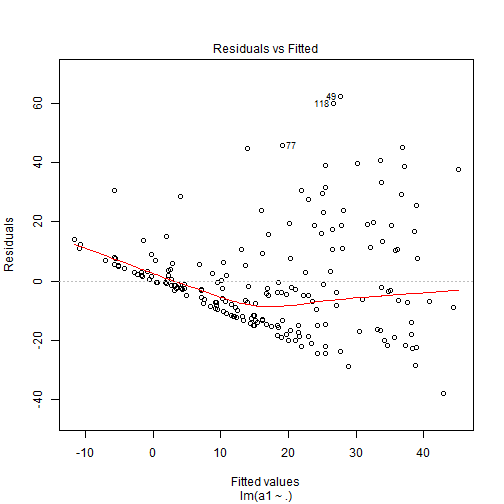 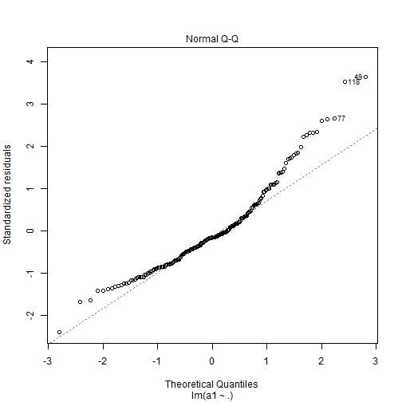 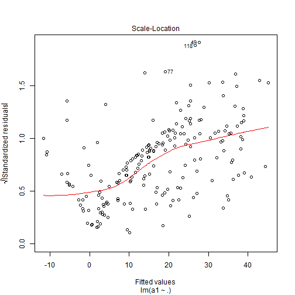 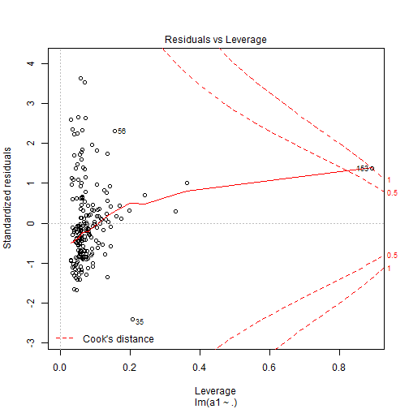 


We start our study of simplifying the linear model using the `anova()` function


```r
anova(lm.a1)
```

```
## Analysis of Variance Table
## 
## Response: a1
##            Df Sum Sq Mean Sq F value  Pr(>F)    
## season      3     85      28    0.09 0.96519    
## size        2  11401    5701   18.31 5.7e-08 ***
## speed       2   3934    1967    6.32 0.00222 ** 
## mxPH        1   1329    1329    4.27 0.04026 *  
## mnO2        1   2287    2287    7.34 0.00737 ** 
## Cl          1   4304    4304   13.82 0.00027 ***
## NO3         1   3418    3418   10.98 0.00111 ** 
## NH4         1    404     404    1.30 0.25638    
## oPO4        1   4788    4788   15.38 0.00012 ***
## PO4         1   1406    1406    4.51 0.03496 *  
## Chla        1    377     377    1.21 0.27265    
## Residuals 182  56668     311                    
## ---
## Signif. codes:  0 '***' 0.001 '**' 0.01 '*' 0.05 '.' 0.1 ' ' 1
```


These results indicate that the variableseason is the variable that least contributes to the reduction of the fitting error of the model. Let us remove it from the model:


```r
lm2.a1 <- update(lm.a1, . ~ . - season)
```


- `update()`: used to perform small changes to an existing linear model. In this case we use it to obtain a new model by removing the variable `season` from the `lm.a1model`.


```r
summary(lm2.a1)
```

```
## 
## Call:
## lm(formula = a1 ~ size + speed + mxPH + mnO2 + Cl + NO3 + NH4 + 
##     oPO4 + PO4 + Chla, data = clean.algae[, 1:12])
## 
## Residuals:
##    Min     1Q Median     3Q    Max 
## -36.46 -11.95  -3.04   7.44  63.73 
## 
## Coefficients:
##              Estimate Std. Error t value Pr(>|t|)   
## (Intercept) 44.953287  23.237838    1.93   0.0546 . 
## sizemedium   3.309210   3.782522    0.87   0.3828   
## sizesmall   10.273096   4.122316    2.49   0.0136 * 
## speedlow     3.054627   4.610807    0.66   0.5085   
## speedmedium -0.297687   3.181858   -0.09   0.9256   
## mxPH        -3.268428   2.657659   -1.23   0.2203   
## mnO2         0.801176   0.658964    1.22   0.2256   
## Cl          -0.038188   0.033379   -1.14   0.2541   
## NO3         -1.533430   0.547655   -2.80   0.0057 **
## NH4          0.001578   0.000995    1.59   0.1146   
## oPO4        -0.006239   0.039509   -0.16   0.8747   
## PO4         -0.050954   0.030519   -1.67   0.0967 . 
## Chla        -0.084137   0.079446   -1.06   0.2910   
## ---
## Signif. codes:  0 '***' 0.001 '**' 0.01 '*' 0.05 '.' 0.1 ' ' 1
## 
## Residual standard error: 17.6 on 185 degrees of freedom
## Multiple R-squared:  0.368,	Adjusted R-squared:  0.327 
## F-statistic: 8.98 on 12 and 185 DF,  p-value: 1.76e-13
```


The fit has improved a bit (32.8%) but it is still not too impressive. We
can carry out a more formal comparison between the two models by using again the `anova()` function, but this time with both models as arguments.


```r
anova(lm.a1, lm2.a1)
```

```
## Analysis of Variance Table
## 
## Model 1: a1 ~ season + size + speed + mxPH + mnO2 + Cl + NO3 + NH4 + oPO4 + 
##     PO4 + Chla
## Model 2: a1 ~ size + speed + mxPH + mnO2 + Cl + NO3 + NH4 + oPO4 + PO4 + 
##     Chla
##   Res.Df   RSS Df Sum of Sq    F Pr(>F)
## 1    182 56668                         
## 2    185 57116 -3      -448 0.48    0.7
```


This function performs an analysis of variance of the two models using an F-test to assess the significance of the differences. In this case, although the sum of the squared errors has decreased (��?448), the comparison shows that the differences are not significant (a value of 0.6971 tells us that with only around 30% confidence we can say they are different).

In order to check if we can remove more coefficients, we would again use the `anova()`  function, applied to the `lm2.a1` model.

#### creates a linear model that results from applying the backward elimination method to the initial model we have obtained (`lm.a1`)


```r
final.lm <- step(lm.a1)
```

```
## Start:  AIC=1152
## a1 ~ season + size + speed + mxPH + mnO2 + Cl + NO3 + NH4 + oPO4 + 
##     PO4 + Chla
## 
##          Df Sum of Sq   RSS  AIC
## - season  3       448 57116 1148
## - speed   2       270 56938 1149
## - oPO4    1         6 56674 1150
## - Chla    1       377 57045 1151
## - Cl      1       443 57112 1152
## - mxPH    1       549 57217 1152
## <none>                56668 1152
## - mnO2    1       694 57363 1152
## - NH4     1       826 57494 1153
## - PO4     1       898 57567 1153
## - size    2      1857 58526 1154
## - NO3     1      2339 59008 1158
## 
## Step:  AIC=1148
## a1 ~ size + speed + mxPH + mnO2 + Cl + NO3 + NH4 + oPO4 + PO4 + 
##     Chla
## 
##         Df Sum of Sq   RSS  AIC
## - speed  2       211 57327 1144
## - oPO4   1         8 57124 1146
## - Chla   1       346 57462 1147
## - Cl     1       404 57520 1147
## - mnO2   1       456 57572 1147
## - mxPH   1       467 57583 1147
## <none>               57116 1148
## - NH4    1       776 57892 1148
## - PO4    1       861 57977 1149
## - size   2      2176 59292 1151
## - NO3    1      2420 59537 1154
## 
## Step:  AIC=1144
## a1 ~ size + mxPH + mnO2 + Cl + NO3 + NH4 + oPO4 + PO4 + Chla
## 
##        Df Sum of Sq   RSS  AIC
## - oPO4  1        16 57343 1142
## - Chla  1       223 57550 1143
## - mnO2  1       414 57740 1144
## - Cl    1       473 57799 1144
## - mxPH  1       484 57810 1144
## <none>              57327 1144
## - NH4   1       720 58047 1145
## - PO4   1       809 58136 1145
## - size  2      2061 59388 1147
## - NO3   1      2380 59706 1150
## 
## Step:  AIC=1142
## a1 ~ size + mxPH + mnO2 + Cl + NO3 + NH4 + PO4 + Chla
## 
##        Df Sum of Sq   RSS  AIC
## - Chla  1       208 57551 1141
## - mnO2  1       403 57746 1142
## - Cl    1       471 57814 1142
## - mxPH  1       520 57863 1142
## <none>              57343 1142
## - NH4   1       704 58047 1143
## - size  2      2050 59393 1145
## - NO3   1      2370 59713 1148
## - PO4   1      5818 63161 1160
## 
## Step:  AIC=1141
## a1 ~ size + mxPH + mnO2 + Cl + NO3 + NH4 + PO4
## 
##        Df Sum of Sq   RSS  AIC
## - mnO2  1       435 57986 1141
## - Cl    1       438 57989 1141
## <none>              57551 1141
## - NH4   1       747 58298 1142
## - mxPH  1       833 58384 1142
## - size  2      2218 59768 1145
## - NO3   1      2667 60218 1148
## - PO4   1      6310 63860 1160
## 
## Step:  AIC=1141
## a1 ~ size + mxPH + Cl + NO3 + NH4 + PO4
## 
##        Df Sum of Sq   RSS  AIC
## - NH4   1       531 58517 1140
## - Cl    1       585 58571 1141
## <none>              57986 1141
## - mxPH  1       819 58805 1141
## - size  2      2478 60464 1145
## - NO3   1      2251 60237 1146
## - PO4   1      9098 67084 1167
## 
## Step:  AIC=1140
## a1 ~ size + mxPH + Cl + NO3 + PO4
## 
##        Df Sum of Sq   RSS  AIC
## <none>              58517 1140
## - mxPH  1       784 59301 1141
## - Cl    1       836 59353 1141
## - NO3   1      1988 60505 1145
## - size  2      2664 61181 1145
## - PO4   1      8576 67093 1165
```


- `step()`: uses the Akaike Information Criterion (AIC) to perform model search


```r
summary(final.lm)
```

```
## 
## Call:
## lm(formula = a1 ~ size + mxPH + Cl + NO3 + PO4, data = clean.algae[, 
##     1:12])
## 
## Residuals:
##    Min     1Q Median     3Q    Max 
## -28.87 -12.73  -3.74   8.42  62.93 
## 
## Coefficients:
##             Estimate Std. Error t value Pr(>|t|)    
## (Intercept)  57.2855    20.9613    2.73   0.0069 ** 
## sizemedium    2.8005     3.4019    0.82   0.4114    
## sizesmall    10.4064     3.8224    2.72   0.0071 ** 
## mxPH         -3.9708     2.4820   -1.60   0.1113    
## Cl           -0.0523     0.0317   -1.65   0.1003    
## NO3          -0.8953     0.3515   -2.55   0.0116 *  
## PO4          -0.0591     0.0112   -5.29  3.3e-07 ***
## ---
## Signif. codes:  0 '***' 0.001 '**' 0.01 '*' 0.05 '.' 0.1 ' ' 1
## 
## Residual standard error: 17.5 on 191 degrees of freedom
## Multiple R-squared:  0.353,	Adjusted R-squared:  0.332 
## F-statistic: 17.3 on 6 and 191 DF,  p-value: 5.55e-16
```


The proportion of variance explained by this model is still not very interesting. This kind of proportion is usually considered a sign that the linearity assumptions of this model are inadequate for the domain.

### 2.6.2 Regression Trees


```r
library(rpart)
data(algae)
algae <- algae[-manyNAs(algae), ]
rt.a1 <- rpart(a1 ~ ., data = algae[, 1:12])
```


